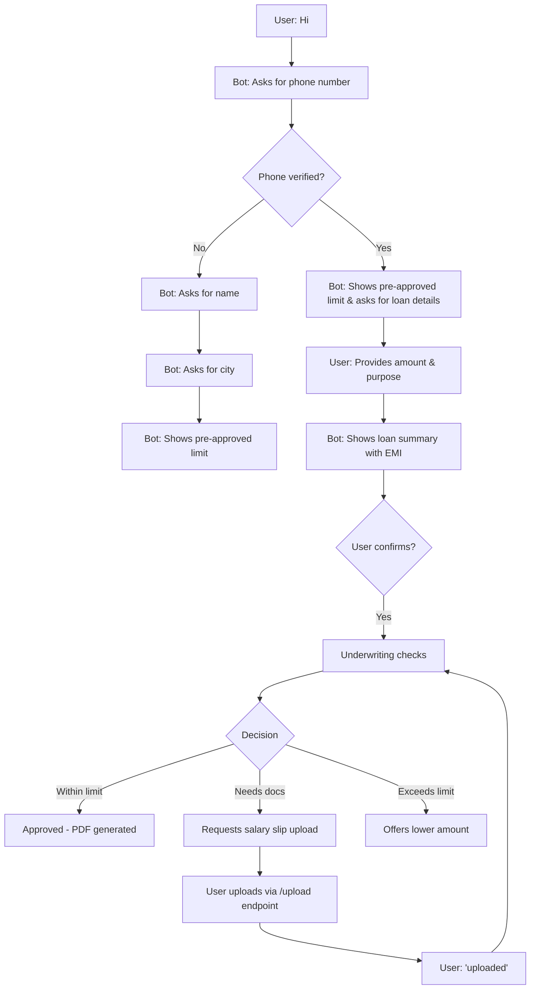

# Backend API Documentation

## Base URL

```
http://127.0.0.1:8000
```

---

## 🔌 API Endpoints

### 1. Health Check

**GET** `/`

Check if the server is running.

**Response:**

```json
{
  "status": "OK",
  "agent": "Loan Bot Ready 🚀"
}
```

---

### 2. Chat with Loan Bot

**POST** `/chat`

Main conversational endpoint for loan processing.

**Request Body:**

```json
{
  "session_id": "user_phone_or_unique_id",
  "message": "User's message text",
  "tenure": 12 // Optional: Loan tenure in months (default: 12)
}
```

**Request Example:**

```javascript
fetch("http://127.0.0.1:8000/chat", {
  method: "POST",
  headers: {
    "Content-Type": "application/json",
  },
  body: JSON.stringify({
    session_id: "9876543210",
    message: "Hi, I need a loan",
    tenure: 12,
  }),
});
```

**Response:**

```json
{
  "response": "AI assistant's reply text (may include structured tags)"
}
```

**Response with Structured Tags (for Frontend Cards):**

The bot response may include structured tags that your frontend can parse to render special cards:

```json
{
  "response": "[LOAN_OFFER]{\"preApprovedLimit\":500000,\"interestRate\":12,\"maxTenure\":60}[/LOAN_OFFER]\n✅ KYC Verification Successful!\n\n👤 Name: Amit Sharma\n..."
}
```

**Available Structured Tags:**

1. **Loan Offer Card** - Shows pre-approved limit

```
[LOAN_OFFER]{"preApprovedLimit":500000,"interestRate":12,"maxTenure":60}[/LOAN_OFFER]
```

2. **Loan Summary Card** - Shows loan details with EMI

```
[LOAN_SUMMARY]{"amount":300000,"interestRate":12,"tenure":12,"emi":26614.35}[/LOAN_SUMMARY]
```

3. **Approval Card** - Shows approved loan with PDF link

```
[APPROVAL]{"name":"Amit Sharma","amount":300000,"emi":"26614.35","pdfLink":"http://127.0.0.1:8000/pdfs/9999999991_sanction.pdf"}[/APPROVAL]
```

4. **Rejection Card** - Shows rejection reason

```
[REJECTION]{"reason":"Low credit score (650). We need a minimum score of 700","creditScore":650}[/REJECTION]
```

**Error Response (500):**

```json
{
  "detail": "Error message"
}
```

---

### 3. Upload Salary Slip

**POST** `/upload`

Upload salary slip PDF for income verification.

**Query Parameters:**

- `phone` (required): Customer's phone number

**Request Body:**

- `file`: PDF file (multipart/form-data)

**Request Example (JavaScript):**

```javascript
const formData = new FormData();
formData.append("file", pdfFile); // pdfFile is a File object

fetch("http://127.0.0.1:8000/upload?phone=9876543210", {
  method: "POST",
  body: formData,
});
```

**Request Example (cURL):**

```bash
curl -X POST "http://127.0.0.1:8000/upload?phone=9876543210" \
  -F "file=@salary_slip.pdf"
```

**Success Response:**

```json
{
  "status": true,
  "msg": "Salary Slip uploaded successfully"
}
```

**Error Response (500):**

```json
{
  "detail": "Error message"
}
```

---

### 4. Download Sanction Letter

**GET** `/pdfs/{filename}`

Serve generated sanction letter PDFs.

**Example:**

```
http://127.0.0.1:8000/pdfs/9876543210_sanction.pdf
```

The bot provides this link automatically after loan approval.

---

## 💬 Conversation Flow

### Typical User Journey



---

## 🤖 Bot Conversation Patterns

### 1. New User Registration Flow

```
User: "9999999999"
Bot: "You seem new. What is your Full Name?"

User: "John Doe"
Bot: "Great! Nice to meet you John Doe 😊. Which city do you live in?"

User: "Mumbai"
Bot: "🎉 Registration Complete!
     📍 Address: [auto-generated]
     🏦 Pre-approved Limit: ₹5,00,000

     Now, please tell me:
     1. How much loan do you need?
     2. What is the purpose? (Wedding, Medical, Travel, etc.)"
```

### 2. Returning User Flow

```
User: "9999999991"
Bot: "✅ KYC Verification Successful!
     👤 Name: Amit Sharma
     📍 Address: Flat 12B, Sea View Apartments, Andheri West, Mumbai 400053
     💳 Credit Score: 780
     🏦 Pre-approved Limit: ₹5,00,000

     Is your address correct? If yes, please tell me:
     1. How much loan do you need?
     2. What is the purpose?"
```

### 3. Loan Request Flow

```
User: "I need 3 lakh for wedding"
Bot: "Perfect! For your Wedding needs, here's what I can offer:
     💰 Loan Summary
     📊 Amount: ₹3,00,000
     📈 Interest Rate: 12% p.a.
     📅 Tenure: 12 months
     💵 Est. EMI: ₹26,614.35/month

     ✅ Ready to proceed? (yes/no)"

User: "yes"
Bot: [Performs underwriting...]
```

### 4. Approval Scenarios

#### a) Instant Approval (Within Limit)

```
Bot: "🎉 Loan Approved!
     ✅ Name: Amit Sharma
     ✅ Loan Amount: ₹3,00,000
     ✅ Final EMI: ₹26,614.35

     📄 [Click here to download your Sanction Letter](http://127.0.0.1:8000/pdfs/9999999991_sanction.pdf)"
```

#### b) Needs Income Verification

```
Bot: "Amount above instant limit ⚠️ Please upload your salary slip to continue.

     Once uploaded, just reply 'uploaded' here and I'll re-check your eligibility."

[User uploads via /upload endpoint]

User: "uploaded"
Bot: [Re-runs underwriting with salary check]
     - If EMI ≤ 50% salary → Approved
     - If EMI > 50% salary → Offers lower amount
```

#### c) Salary-Based Rejection (EMI > 50%)

```
Bot: "I understand you were looking for ₹6,00,000, but let me share some good news! 🌟

     Based on your salary of ₹80,000, I can approve up to ₹4,50,000 to keep your EMI
     manageable at ₹39,921.52. This ensures comfortable repayment!

     📊 Alternative Offer:
     💰 Amount: ₹4,50,000
     💵 EMI: ₹39,921.52/month
     📈 Interest: 12% p.a.

     Would you like to proceed with ₹4,50,000? (yes/no)"
```

#### d) Hard Rejection (Low Credit Score)

```
Bot: "❌ Application Rejected.
     Reason: Low credit score (650). We need a minimum score of 700 for loan approval."
```

---

## 📝 Session Management

### Session ID

- Use a **unique identifier** per user (phone number recommended)
- All messages in the same session maintain conversation context
- The bot remembers previous interactions within a session

### Resume Conversation

If user says **"hi"** mid-conversation:

```
Bot: "It looks like you were in the middle of a loan application earlier.
     Reply resume to continue from where you stopped or start new to begin again."
```

### Reset Conversation

Keywords: `reset`, `restart`, `cancel`, `start new`

---

## 🧪 Testing with Sample Users

### Test Phone Numbers

| Phone Number | Credit Score | Pre-approved Limit | Expected Behavior              |
| ------------ | ------------ | ------------------ | ------------------------------ |
| 9999999991   | 780          | ₹5,00,000          | ✅ Standard approval           |
| 9999999992   | 820          | ₹8,00,000          | ✅ High limit approval         |
| 9999999994   | **650**      | ₹3,00,000          | ❌ **Hard reject** (low score) |
| 9999999997   | **850**      | ₹10,00,000         | ✅ **Premium** customer        |
| 9999999998   | **680**      | ₹3,50,000          | ❌ **Hard reject** (low score) |

---

## 🎯 Frontend Implementation Guide

### React Example

```javascript
import { useState } from "react";

function ChatBot() {
  const [messages, setMessages] = useState([]);
  const [input, setInput] = useState("");
  const [sessionId, setSessionId] = useState("user123"); // Use actual user ID

  const sendMessage = async () => {
    // Add user message to chat
    setMessages([...messages, { role: "user", content: input }]);

    // Send to backend
    const response = await fetch("http://127.0.0.1:8000/chat", {
      method: "POST",
      headers: { "Content-Type": "application/json" },
      body: JSON.stringify({
        session_id: sessionId,
        message: input,
        tenure: 12,
      }),
    });

    const data = await response.json();

    // Add bot response to chat
    setMessages([
      ...messages,
      { role: "user", content: input },
      { role: "bot", content: data.response },
    ]);

    setInput("");
  };

  return (
    <div>
      <div className="chat-history">
        {messages.map((msg, i) => (
          <div key={i} className={msg.role}>
            {msg.content}
          </div>
        ))}
      </div>
      <input
        value={input}
        onChange={(e) => setInput(e.target.value)}
        onKeyPress={(e) => e.key === "Enter" && sendMessage()}
      />
      <button onClick={sendMessage}>Send</button>
    </div>
  );
}
```

### File Upload Component

```javascript
function SalarySlipUpload({ phone }) {
  const [file, setFile] = useState(null);

  const handleUpload = async () => {
    const formData = new FormData();
    formData.append("file", file);

    const response = await fetch(
      `http://127.0.0.1:8000/upload?phone=${phone}`,
      {
        method: "POST",
        body: formData,
      }
    );

    const result = await response.json();
    console.log(result); // { status: true, msg: "..." }
  };

  return (
    <div>
      <input
        type="file"
        accept=".pdf"
        onChange={(e) => setFile(e.target.files[0])}
      />
      <button onClick={handleUpload}>Upload Salary Slip</button>
    </div>
  );
}
```

---

## 🚨 Important Notes

### CORS Setup

✅ **Already Configured!** The backend is set up to accept requests from:

- `http://localhost:8080`
- `http://127.0.0.1:8080`
- `http://localhost:3000`
- `http://127.0.0.1:3000`

If you need to add more origins, edit `main.py`:

```python
app.add_middleware(
    CORSMiddleware,
    allow_origins=[
        "http://localhost:8080",  # Your frontend URL
        "http://your-domain.com"  # Add production URL
    ],
    allow_credentials=True,
    allow_methods=["*"],
    allow_headers=["*"],
)
```

### File Upload Size

Default FastAPI limit is 1MB. To increase:

```python
from fastapi import FastAPI

app = FastAPI()
app.router.lifespan_context["max_body_size"] = 10 * 1024 * 1024  # 10MB
```

### Session Persistence

- Chat history is stored in SQLite (`chat_history.db`)
- Conversations persist across server restarts
- To clear history for a session, you'd need to add a DELETE endpoint

---

## 🔧 Environment Variables

Create `.env` file:

```
GOOGLE_API_KEY=your_gemini_api_key_here
```

Get your API key from: https://makersuite.google.com/app/apikey

---

## 📊 Response Time

- Typical response: **2-5 seconds** (depends on Gemini API)
- File upload: **< 1 second**
- PDF generation: **< 1 second**

---

## 🐛 Debugging Tips

### Check Server Logs

All print statements appear in the terminal where `uvicorn` is running.

### Test Endpoints with cURL

```bash
# Test health check
curl http://127.0.0.1:8000/

# Test chat
curl -X POST http://127.0.0.1:8000/chat \
  -H "Content-Type: application/json" \
  -d '{"session_id":"test123","message":"Hi"}'

# Test upload
curl -X POST "http://127.0.0.1:8000/upload?phone=9876543210" \
  -F "file=@test.pdf"
```

### View Database

```bash
sqlite3 chat_history.db
.tables
SELECT * FROM messages WHERE session_id='test123';
```

---

## 📞 Support Queries

The bot can handle:

- Loan amount in various formats: "5 lakh", "2.5L", "50000", "40k"
- Purpose keywords: wedding, medical, travel, education, home, business, etc.
- Common phrases: "I need a loan", "apply for loan", "check eligibility"
- Resume/restart: "resume", "start new", "reset"

---

## 🎨 UI/UX Recommendations

1. **Show typing indicator** while waiting for bot response
2. **Format numbers** with commas (₹5,00,000 instead of ₹500000)
3. **Highlight important info** (EMI, loan amount, interest rate)
4. **Make PDF links clickable** - extract URLs from markdown format
5. **Add file upload button** when bot mentions "upload salary slip"
6. **Persist chat history** in localStorage for page refreshes
7. **Show credit score & limit** prominently after verification

---

## 🎴 Parsing Structured Tags for Cards

### JavaScript Helper Function

```javascript
function parseStructuredTags(message) {
  const tags = {
    loanOffer: null,
    loanSummary: null,
    approval: null,
    rejection: null,
    cleanMessage: message,
  };

  // Parse LOAN_OFFER
  const loanOfferMatch = message.match(
    /\[LOAN_OFFER\](\{.*?\})\[\/LOAN_OFFER\]/
  );
  if (loanOfferMatch) {
    tags.loanOffer = JSON.parse(loanOfferMatch[1]);
    tags.cleanMessage = tags.cleanMessage.replace(loanOfferMatch[0], "").trim();
  }

  // Parse LOAN_SUMMARY
  const loanSummaryMatch = message.match(
    /\[LOAN_SUMMARY\](\{.*?\})\[\/LOAN_SUMMARY\]/
  );
  if (loanSummaryMatch) {
    tags.loanSummary = JSON.parse(loanSummaryMatch[1]);
    tags.cleanMessage = tags.cleanMessage
      .replace(loanSummaryMatch[0], "")
      .trim();
  }

  // Parse APPROVAL
  const approvalMatch = message.match(/\[APPROVAL\](\{.*?\})\[\/APPROVAL\]/);
  if (approvalMatch) {
    tags.approval = JSON.parse(approvalMatch[1]);
    tags.cleanMessage = tags.cleanMessage.replace(approvalMatch[0], "").trim();
  }

  // Parse REJECTION
  const rejectionMatch = message.match(/\[REJECTION\](\{.*?\})\[\/REJECTION\]/);
  if (rejectionMatch) {
    tags.rejection = JSON.parse(rejectionMatch[1]);
    tags.cleanMessage = tags.cleanMessage.replace(rejectionMatch[0], "").trim();
  }

  return tags;
}
```

### React Component Example

```javascript
function BotMessage({ message }) {
  const parsed = parseStructuredTags(message);

  return (
    <div className="bot-message">
      {/* Render Loan Offer Card */}
      {parsed.loanOffer && (
        <div className="loan-offer-card">
          <h3>Pre-Approved Loan Offer!</h3>
          <p>Limit: ₹{parsed.loanOffer.preApprovedLimit.toLocaleString()}</p>
          <p>Interest: {parsed.loanOffer.interestRate}% p.a.</p>
          <p>Max Tenure: {parsed.loanOffer.maxTenure} months</p>
        </div>
      )}

      {/* Render Loan Summary Card */}
      {parsed.loanSummary && (
        <div className="loan-summary-card">
          <h3>Loan Summary</h3>
          <p>Amount: ₹{parsed.loanSummary.amount.toLocaleString()}</p>
          <p>
            EMI: ₹{parseFloat(parsed.loanSummary.emi).toLocaleString()}/month
          </p>
          <p>Interest: {parsed.loanSummary.interestRate}% p.a.</p>
          <p>Tenure: {parsed.loanSummary.tenure} months</p>
        </div>
      )}

      {/* Render Approval Card */}
      {parsed.approval && (
        <div className="approval-card success">
          <h3>🎉 Loan Approved!</h3>
          <p>Name: {parsed.approval.name}</p>
          <p>Amount: ₹{parsed.approval.amount.toLocaleString()}</p>
          <p>EMI: ₹{parseFloat(parsed.approval.emi).toLocaleString()}/month</p>
          <a href={parsed.approval.pdfLink} target="_blank">
            Download Sanction Letter
          </a>
        </div>
      )}

      {/* Render Rejection Card */}
      {parsed.rejection && (
        <div className="rejection-card error">
          <h3>❌ Application Rejected</h3>
          <p>{parsed.rejection.reason}</p>
          {parsed.rejection.creditScore && (
            <p>Credit Score: {parsed.rejection.creditScore}</p>
          )}
        </div>
      )}

      {/* Render Clean Message Text */}
      <div className="message-text">{parsed.cleanMessage}</div>
    </div>
  );
}
```

### Example Usage in Chat

```javascript
const sendMessage = async (userMessage) => {
  const response = await fetch("http://127.0.0.1:8000/chat", {
    method: "POST",
    headers: { "Content-Type": "application/json" },
    body: JSON.stringify({
      session_id: sessionId,
      message: userMessage,
    }),
  });

  const data = await response.json();
  const parsed = parseStructuredTags(data.response);

  // Now you have:
  // - parsed.loanOffer: Loan offer data (if present)
  // - parsed.loanSummary: Loan summary data (if present)
  // - parsed.approval: Approval data (if present)
  // - parsed.rejection: Rejection data (if present)
  // - parsed.cleanMessage: Message without tags

  addMessageToChat({
    role: "bot",
    content: data.response,
    parsed: parsed,
  });
};
```

---

## 🔐 Security Considerations (Production)

1. Add authentication (JWT tokens)
2. Rate limiting on endpoints
3. Validate file uploads (check PDF mime type, scan for malware)
4. Sanitize user inputs
5. Use HTTPS in production
6. Implement proper error handling
7. Add request logging and monitoring
